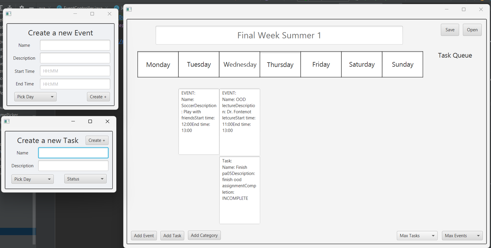

# 3500 PA05 Project Repo
Always wanted to have a secure way to access you journal and open from another device.
Introducing Journ-ally, this new and inventive app allows users to safely access their
journals and store them in them using Json encoding. In addition, we have provided the ability
to set a task queue and categorize your events and tasks based on preference. In addition,
we added the ability to see your progress throughout the week by having a week overview.
There is splash screen with a secure password that is generated once you join. 

We used different controllers to apply the single responsibility principle. For example, we set
the different pop-ups with their own controllers. The only reason one of these controllers would 
is a change in the FXML and how it fits into the project structure. In addition, if this changes
on the other functionality as it handles a single event.

We made use of the open and closed principle as we made the model and then passed the functionality
to the rest of the program. This allowed use to make parameters and pass them onto others. In addition,
setting the controller in the start method allowed us to use the controller functionality and closing
the functionality. In addition, we kept certain methods private to prevent mutation.

For the Liskov Substitution, the week is a subclass of day. The week can be substituted with the day and
the functionality would still work. Allowing for superclasses to be substituted with their subclasses in manner that
doesn't break the program.

Interface Segregation, items interface to form loose coupling, of the events and tasks that are made.
Allowing for effective handling of polymorphisms in the model. In addition, we set up the pop-up controller
allowing us to separate implementation of the different pop-up controllers and allowing extensibility when 
adding a new controller.

Our journal controller does not depend on the low level modules in the model. This is a clear example of the 
dependency inversion principle. The high level modules in the controllers can interact with the model without having
to know its implementation details.

Our application is extensible to future functionality through the implementation of interfaces in our model and the 
dependency inversion in the controller. In addition, the separation of the MVC allows the creator to extend the 
separate sections without altering the rest. Having followed SOLID principles also helps to make our application 
extensible. It gives the developer the possibility of adding new popups, buttons and adding more elements such as the
specific day of the month possible without modifying existing code.

Journ-ally

[PA Write Up](https://markefontenot.notion.site/PA-05-8263d28a81a7473d8372c6579abd6481)

Old Design

